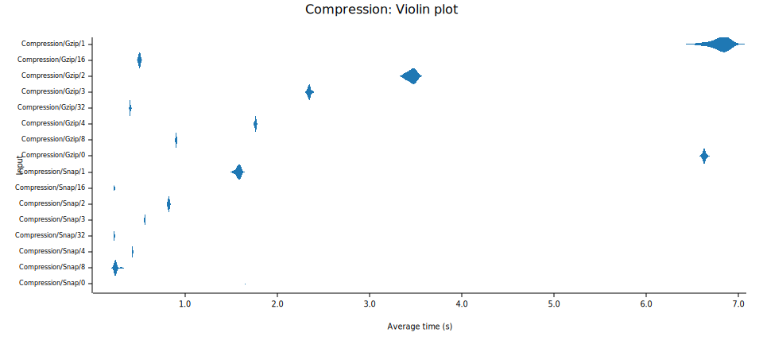

# ⛓️gzp

<p align="center">
  <a href="https://github.com/sstadick/gzp/actions?query=workflow%3Aci"></a>
  
  <a href="https://crates.io/crates/gzp"></a><br>
</p>

Multithreaded gzip encoding.

## Why?

This crate provides a near drop in replacement for `Write` that has will compress chunks of data in parallel and write
to an underlying writer in the same order that the bytes were handed to the writer. This allows for much faster
compression of Gzip data.

## Usage

```toml
[dependencies]
gzp = { version = "*", features = ["zlib-ng-compat"] }
```

## Examples

Simple example

```rust
use std::{env, fs::File, io::Write};

use gzp::ParGz;

fn main() {
    let file = env::args().skip(1).next().unwrap();
    let writer = File::create(file).unwrap();
    let mut par_gz = ParGz::builder(writer).build();
    par_gz.write_all(b"This is a first test line\n").unwrap();
    par_gz.write_all(b"This is a second test line\n").unwrap();
    par_gz.finish().unwrap();
}
```

An updated version of [pgz](https://github.com/vorner/pgz).

```rust
use gzp::ParGz;
use std::io::{Read, Write};

fn main() {
    let chunksize = 64 * (1 << 10) * 2;

    let stdout = std::io::stdout();
    let mut writer = ParGz::builder(stdout).build();

    let stdin = std::io::stdin();
    let mut stdin = stdin.lock();

    let mut buffer = Vec::with_capacity(chunksize);
    loop {
        let mut limit = (&mut stdin).take(chunksize as u64);
        limit.read_to_end(&mut buffer).unwrap();
        if buffer.is_empty() {
            break;
        }
        writer.write_all(&buffer).unwrap();
        buffer.clear();
    }
    writer.finish().unwrap();
}
```

## Notes

- Files written with this are just Gzipped blocks catted together and must be read
  with `flate2::bufread::MultiGzDecoder`.

## Future todos

- Explore removing `Bytes` in favor of raw vec
- Check that block is actually smaller than when it started
- Update the CRC value with each block written
- Add a BGZF mode + tabix index generation (or create that as its own crate)

## Benchmarks

